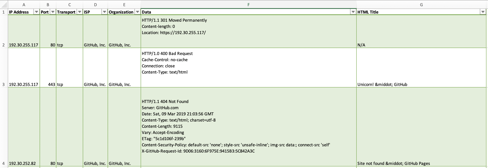

# Shodarin

Shodarin is an OSINT tool that will extract a company's public IP ranges/CIDR notations from the American Registry for Internet Numbers (ARIN), then feed those results to Shodan to discover open ports on those addresses.

By default, the exact company name will be searched for and results will be sent to stdout in the form of `ip:port`. It's recommended to specify an output file since the CSV file will contain more data.

Currently, the `net` filter on Shodan doesn't support IPv6. Until it does, IPv6 queries will not be performed. 

#### ***Since this tool performs Shodan queries, you will need to modify the source with your Shodan API key!***

## Help message

```
$ python3 shodarin.py -h

 .::::::.   ::   .:      ...    :::::::-.    :::.    :::::::..   ::::::.    :::.
;;;`    `  ,;;   ;;,  .;;;;;;;.  ;;,   `';,  ;;`;;   ;;;;``;;;;  ;;;`;;;;,  `;;;
'[==/[[[[,,[[[,,,[[[ ,[[     \[[,`[[     [[ ,[[ '[[,  [[[,/[[['  [[[  [[[[[. '[[
  '''    $"$$$"""$$$ $$$,     $$$ $$,    $$c$$$cc$$$c $$$$$$c    $$$  $$$ "Y$c$$
 88b    dP 888   "88o"888,_ _,88P 888_,o8P' 888   888,888b "88bo,888  888    Y88
  "YMmMY"  MMM    YMM  "YMMMMMP"  MMMMP"`   YMM   ""` MMMM   "W" MMM  MMM     YM

                                            Author: @fragsh3ll

usage: shodarin.py [-h] [-o OUTFILE] [-w] [-a] [-n] company

positional arguments:
  company               Company to query on ARIN

optional arguments:
  -h, --help            show this help message and exit
  -o OUTFILE, --outfile OUTFILE
                        (Recommended) Name of CSV output file for Shodan
                        results
  -w, --wildcard        Perform a wildcard search. This will search using
                        "*company name*" instead of just "company name". Not
                        recommended for smaller company names
  -a, --arin            Skip Shodan lookup and only output the discovered CIDR
                        notations from ARIN
  -n, --no-prompt       Do not prompt to continue when discovering a large
                        amount of organizations
  -p PORTS, --ports PORTS
                        Only show results for specified ports (ex: 21,80,443)
```
## Usage example:
```
$ python3 shodarin.py -w github

 .::::::.   ::   .:      ...    :::::::-.    :::.    :::::::..   ::::::.    :::.
;;;`    `  ,;;   ;;,  .;;;;;;;.  ;;,   `';,  ;;`;;   ;;;;``;;;;  ;;;`;;;;,  `;;;
'[==/[[[[,,[[[,,,[[[ ,[[     \[[,`[[     [[ ,[[ '[[,  [[[,/[[['  [[[  [[[[[. '[[
  '''    $"$$$"""$$$ $$$,     $$$ $$,    $$c$$$cc$$$c $$$$$$c    $$$  $$$ "Y$c$$
 88b    dP 888   "88o"888,_ _,88P 888_,o8P' 888   888,888b "88bo,888  888    Y88
  "YMmMY"  MMM    YMM  "YMMMMMP"  MMMMP"`   YMM   ""` MMMM   "W" MMM  MMM     YM

                                            Author: @fragsh3ll

[*] Searching ARIN for *github*...

[*] 1 organizational result discovered for github

[*] Checking GitHub, Inc. (GITHU) for netblocks...
	[+] range: 192.30.252.0 - 192.30.255.255
		[+] CIDR: 192.30.252.0/22
	[+] range: 2620:112:3000:: - 2620:112:300F:FFFF:FFFF:FFFF:FFFF:FFFF
		[+] CIDR: 2620:112:3000::/44
	[+] range: 140.82.112.0 - 140.82.127.255
		[+] CIDR: 140.82.112.0/20

[*] Discovered CIDR notations for github:

[*] IPv4 CIDR Notations:
GitHub, Inc. (GITHU) - 192.30.252.0/22
GitHub, Inc. (GITHU) (0) - 140.82.112.0/20

[*] IPv6 CIDR Notations:
GitHub, Inc. (GITHU) (0) - 2620:112:3000::/44

[*] Searching for open ports on Shodan for discovered CIDR notations...

[*] Matches for 192.30.252.0/22
	[+] 192.30.255.117:80
	[+] 192.30.255.117:443
	[+] 192.30.252.82:443
	[+] 192.30.253.66:80
  
<<snipped>>
```
## CSV Example

